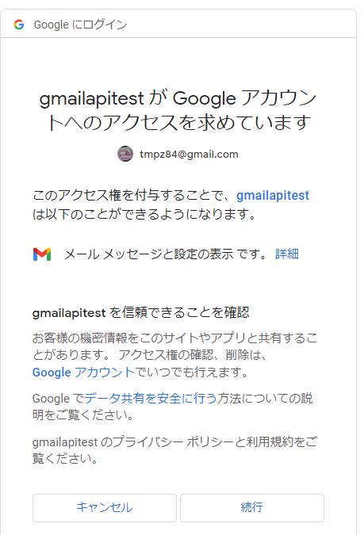
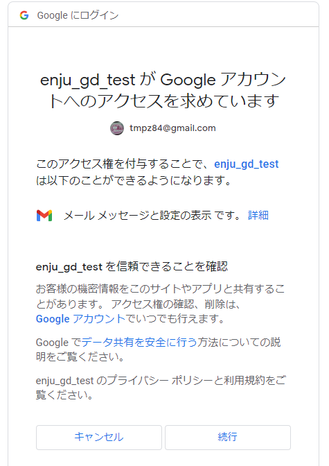

# GmailFetcher

Gmail API を使ってメールの添付ファイルをダウンロードするサンプルプログラムです。

# 事前準備１

github.com/mattn/go-sqlite3 はcgoパッケージであるため、
go-sqlite3を使用してアプリをビルドする場合は、gccが必要です。

Windowsで利用する場合は以下のアドレスからgcc toolchainのインストールを行います。
https://jmeubank.github.io/tdm-gcc/

以下のインストールファイルをダウンロードしてインストールします。
https://github.com/jmeubank/tdm-gcc/releases/download/v10.3.0-tdm64-2/tdm64-gcc-10.3.0-2.exe

インストールをしたらインストールフォルダのbinをPATHに追加します。
デフォルトでは
C:\TDM-GCC-64\bin
かもしれません。

# 事前準備２
https://developers.google.com/gmail/api/quickstart/go 
の通りですが記載します。

## API を有効にする

以下のアドレスの画面から Gmail API を有効にします。
https://console.cloud.google.com/flows/enableapi?apiid=gmail.googleapis.com

## 認証情報ファイルを作成する

https://console.cloud.google.com/apis/credentials

左側のハンバーガーメニューから
APIとサービス ＞ 認証情報
をクリックします。

認証情報を作成 をクリックして OAuth クライアントID をクリックする。

デスクトップアプリで作成します。

OAuthクライアントを作成しました。と表示されるので
JSONをダウンロードをクリックしてファイルを取得します。
ファイルは動作させる環境にコピーしておきますが、ファイル名を credentials.json としておく必要があります。

## OAuth 認証を行う

git clone gmailfetcher
cd gmailfetcher
go mod tidy
go run fetcher.go

ここで以下のスクリーンショットのように oauth 認証へのアドレスが表示されるので
コンソールからアドレスをブラウザに貼り付けます。

アカウントを選択し

続行をクリックし

localhostにリダイレクトしエラーになりますが、
ブラウザのアドレスバーに必要なパラメータがありますので
codeパラメータの値（～&code=xxxxx&～ となっている xxxxx の部分）をコピーし、
コンソールに貼り付けてエンターキーを押します。

成功するとファイルの取得がはじまります。

# Author, Contributor

Akifumi NAKAMURA (@tmpz84)

# LICENSE

MIT

